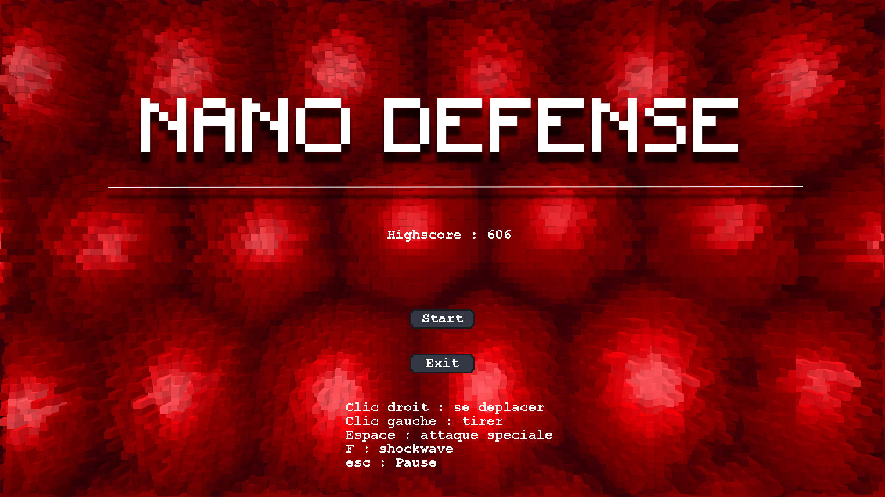
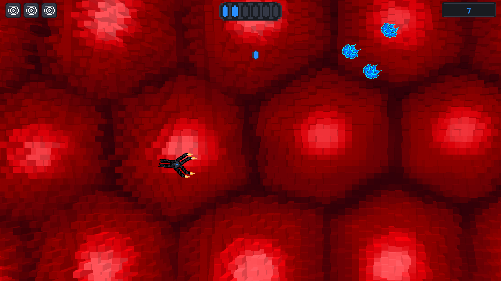
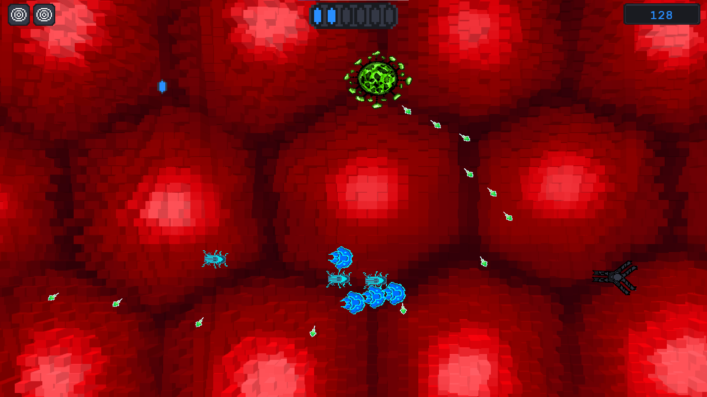
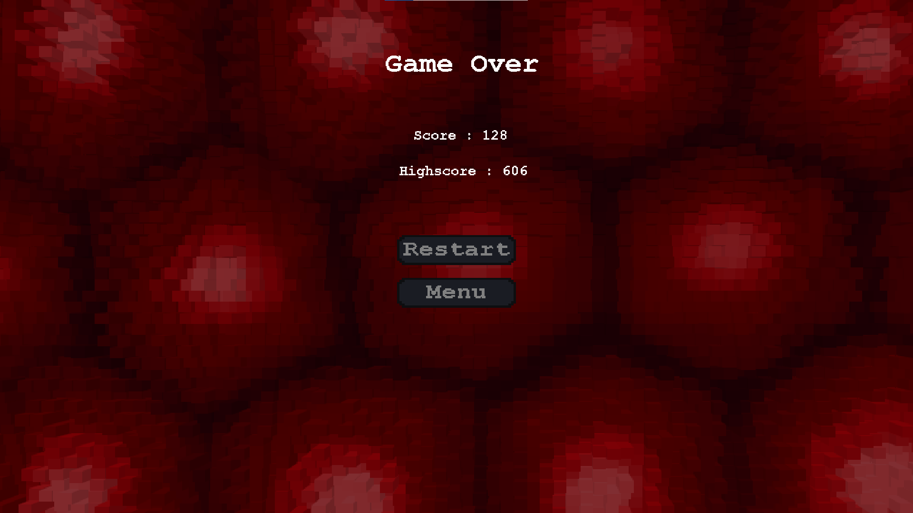

# Nano Defense

Nano Defense is a game developed during a 48h game jam. The theme was "virus". The player is a nano robot that has to defend the human organism from viruses. This is a 2D Scoring game, that use the mechanics of "hit and run". The player can either move or shoot, but not both at the same time. This game was developed with GameMaker Studio 2, with a friend who did the art.

## Images of the game

 

